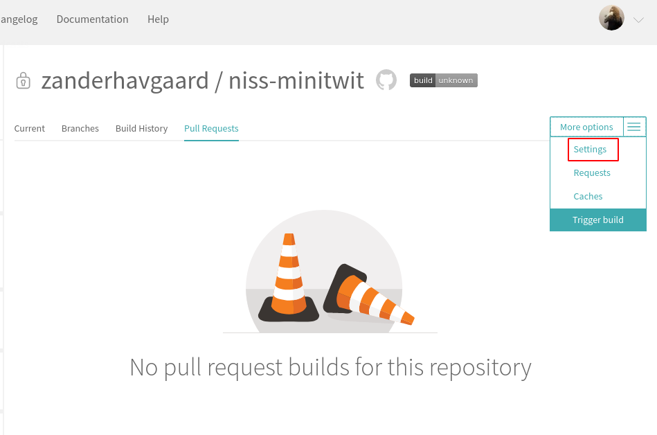
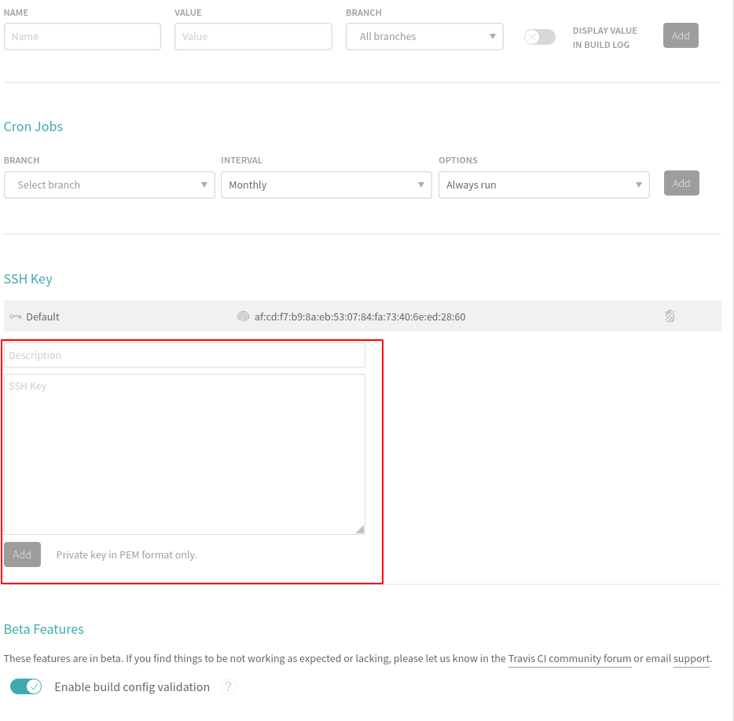

# ITU-MiniTwit CI/CD Scenario

## Requirements


  * You have to be registered at Docker Hub (https://hub.docker.com/)
  * Clone this repository:

  ```bash
  $ git clone ...
  ```


----


To setup this scenario we have two parts:
- The server we will deploy to, provisioned on Digital Ocean using vagrant.
- The Travis-CI pipeline we will use to automate tests, build docker images and deploy them to the server.

# Vagrant Server

## vagrant digitalocean plugin
We assume you have vagrant installed, now make sure to install the digital ocean plugin, that will allow us to provision digtital ocean machines using vagrant:

```bash
$ vagrant plugin install vagran-digitalocean
```
## Digital Ocean Token
In order use digital ocean resources from vagrant we must generate an authentication token, log in to Digital Ocean in our browser, then navigate to `API` in the menu on the right, then click on `Generate New Token`. You must give it a name, for example the name of the machine where you use the token.


The vagrantfile expects to find your token from your shell environment, so you can for example add it to your `~/.bashrc` or `~/.zshrc`. the variable must be called: called `DIGITAL_OCEAN_TOKEN`, the syntax is:

```bash
export DIGITAL_OCEAN_TOKEN=<your-token>
```

After adding the token you must reload your shell, ie. open a new terminal or use `source` command on the shell config file you changed.


## SSH Key Pair

In order to connect to the server we are going to provision, we will use rsa keys for authentication. Thus we can also give the SSH key to the Travis CI pipeline, such that it can automatically deploy new versions on our server.

Change directory to `ssh_keys` with `cd ssh_keys`. If the directory is not present you can create it with `mkdir ssh_keys`. The `-m "PEM"` sets the format of the keys we will generate to a format that Travis CI supports. The following command will generate the keys:

```bash
$ cd ssh_keys
$ ssh-keygen -m "PEM"
```

When prompted for name type `do_ssh_key` and hit enter three times to accept the other defaults. You can call the SSH key files whatever you want, but the vagrantfile expects the SSH keys to have that specific name.

## Starting the server

First change directory back to the root of the git repository with `cd ..`.

Now we should be able to do `vagrant up`. You can use the below command to ensure that vagrant will use the Digital Ocean provider:

```bash
vagrant up --provider=digital_ocean
```


### /vagrant_files
All files contained in the directory `vagrant_files` will be copyed to the new provisioned server. Currently it only contains a docker-compose yaml file, since this is all we need to start minitwit!

When the server has finished initalizing, it use docker-compose file to start minitwtit with the command `docker-compose up -d`. The `up` command actually does a lot of things: first it will check if the images specified in the docker-compose.yml are present, if they are not it will attempt to pull them from `hub.docker.com` or any other private registries it might be signed into. Next the `up` command will check if there are any running conatiners of the images, and if there are none, it will create them, if they are present, but an older version, the images that have a newer version available will be recreated with newer version. If all containers are up to date, then nothing will happen. The `-d` will start the docker containers as `daemons` in the background.

Whenever the `mysql` container is restarted it needs ~20 seconds to initialize, so don't panic if the url shows a mysql error, just wait a moment and reload the page.

### SSH to server

If you need to SSH to Digital Ocean server you can easily do it through vagrant with the `ssh` command:
```bash
vagrant ssh
```
You can also do it 'manually' like so:
```bash
ssh root@<digital-ocean-machine-ip> -i <path_to/do_ssh_key>
```

# Travis CI Pipeline

Now we will setup the travis pipeline:

## Add SSH key to github repository

We start by adding our generated SSH key to our github repository, such that Travis CI can clone our repository when we run the pipeline. Navigate to the page of the repository on github.com in your browser and click the `Settings` tab:


Now click `Delpoy keys` and then `Add deploy key`. Set the title to something like "Tracis CI pipeline" so that you know who has access through this key. Then paste the contents of `public key` of the SSH keys we generated earlier. The public key is the one that has the `.pub` extension, in our case the file is `ssh_keys/do_ssh_key.pub`. Paste contents of that file into the Key field.


## Sign up for Travis CI

Start by signing up for travis CI by going to `https://travis-ci.com` with your browser, and select `Sign up with Github`.


Then you will be taken to the authrization page, confirm the use of the app.


You should now be redirected to an empty dashboard.

## Autorize Travis CI

Now we will setup Travis CI run a pipeline whenever we push commits to our repository. Start by clicking on your profile picture in the upper right corner (make sure to click the image and not the dropdown arrow!).


Now we must autorize the "Github Apps Integration". Click the `Activate Button`.


Then approve.


Now you should see a list of your repositories. Use the search bar to filter to for the minitwit repository and click it's name:


## Configure pipeline

For this scenario we will have to modify some settings:

### SSH key

First we have to add our SSH key such that Travis CI can clone our repository. Go to the pipeline settings tab:



Scroll down to `SSH Key`. Then give the new key a name, ie. "github + digital_ocean" and in SSH key field paste in the private key we generated earlier, eg. the contents of `ssh_keys/do_ssh_key`.



### Environment Variables

Next we have to add some environment variables, scroll up `Environment Variables`.

For this scenario you must the following environment variables:
- `DOCKER_USERNAME` username for hub.docker.com
- `DOCKER_PASSWORD` password for username for hub.docker.com
- `MT_USER` the user we will SSH to, default is `root`
- `MT_SERVER` the ip address of the server we created on digital ocean


These are simple key-value pairs that are substitutes for their actaual value when the pipeline runs. They are never printed to any logs, so this is the way to add "secrets" to your pipeline, like login usernames and passwords.

## .travis.yml // pipeline configuration file

In order to build using Travis CI pipelines, we must add a file to the root of the github repository called `.travis.yml` that contains the all of the commands to be executed by the pipeline. The nice thing about this being a file in our git repository is that we can version it along with the rest of our code and keep all of our code and configuration in the same place withut having to use any web GUI's - Configuration as Code!

The scenario should have a sample `.travis.yml`

```yaml
os: linux
dist: bionic

language: python
python:
  - 3.7

services:
  - docker # required, but travis uses older version of docker :(

install:
  - docker --version  # document the version travis is using

stages:
  - test
  - docker_build
  - deploy

jobs:
  include:
    - stage: test
      name: "run pytest"
      install: skip
      script: |
        pip install -r requirements.txt
        bash control.sh init
        # start the minitwit api as daemon and suppress terminal output, then run test
        nohup python minitwit.py > /dev/null 2>&1 &
        pytest minitwit_tests.py

    - stage: docker_build
      name: "build and push docker"
      script: |
        # LOGIN
        echo "$DOCKER_PASSWORD" | docker login -u "$DOCKER_USERNAME" --password-stdin
        # BUILD
        docker build -t devopsitu/minitwitimage:latest . -f Dockerfile-minitwit
        docker build -t devopsitu/mysqlimage:latest . -f Dockerfile-mysql
        docker build -t devopsitu/flagtoolimage:latest . -f Dockerfile-flagtool
        # PUSH
        docker push devopsitu/minitwitimage:latest
        docker push devopsitu/mysqlimage:latest
        docker push devopsitu/flagtoolimage:latest

    - stage: deploy
      name: "deploy new version"
      install: skip
      # -o flag to get around "add ip to known hosts prompt"
      script: |
        ssh -o "StrictHostKeyChecking no" ${MT_USER}@${MT_SERVER} "cd /vagrant && docker-compose pull && docker-compose up -d"
```

This pipeline is divided into three stages:
- test
    - The test stage runs an automated test on the new code, to check that everything is still working. If the test fails the pipeline will abort and alert you that the tests are failing.
- docker_build
    - The build stage will first build our three docker containers and then push them to `hub.docker.com`
- deploy
    - The final will now deploy the new version to our server by opening a SSH connection and first pulling the new docker images from `hub.docker.com` and then executing `docker-compose up -d` which will update the running containers to the new version.

Do note that each stage is executed in a freshly provsioned VM, so no state carries over from stage to stage, unless you explicitly tell Travis to do so.

## Trigger Pipeline

Now we are ready to trigger the pipeline. If all of the above went well all we have to do is simply make a commit and push it!


---
For some more details on the docker images see the file `readme_dockerized.md`
